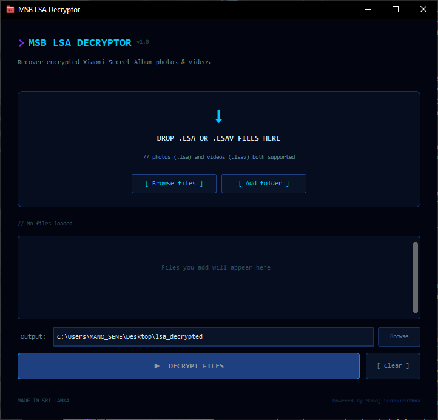

# 🔐 MSB LSA Decryptor

A modern desktop tool to recover encrypted photos and videos from Xiaomi's Secret Album (`.lsa` and `.lsav` files).



---

## 🌐 Official Website

👉 Click here:
**[Visit the Website](https://manox2004.github.io/MSB-LSA-Decryptor/)**

> 💡 If you don’t want to install Python, download the ready-to-use version from the website.

---

## ✨ Features

* 🔓 Decrypt `.lsa` (images) and `.lsav` (videos)
* 📁 Batch processing (multiple files & folders)
* 🖱️ Simple workflow (no technical skills needed)
* ⚡ Fast, threaded decryption
* 📊 Real-time progress tracking
* 🎯 Modern UI
* 🎨 Theme support via website
* 📂 Auto-open output folder

---

## 🚀 Easy Install (Recommended)

For most users:

1. Go to the website
2. Run it — no setup needed ✅

---

## 🧑‍💻 Manual Setup (Advanced Users)

### Requirements

* Python 3.10+
* pip

### Install dependencies

```bash
pip install customtkinter
```

### Run

```bash
python gui.py
```

---

## 📁 How to Use

1. Open the app
2. Add `.lsa` / `.lsav` files or a folder
3. Select output location (optional)
4. Click **Decrypt Files**
5. Done 🎉

---

## ⚠️ Disclaimer

This tool is for **personal use only**.

* Only decrypt your own files
* Respect privacy and laws
* No responsibility for misuse

---

## 🌍 Author

**Manoj Senevirathna**
Made in Sri Lanka 🇱🇰

---

## ⭐ Support

If this helped you, consider giving a ⭐ on GitHub!

---
